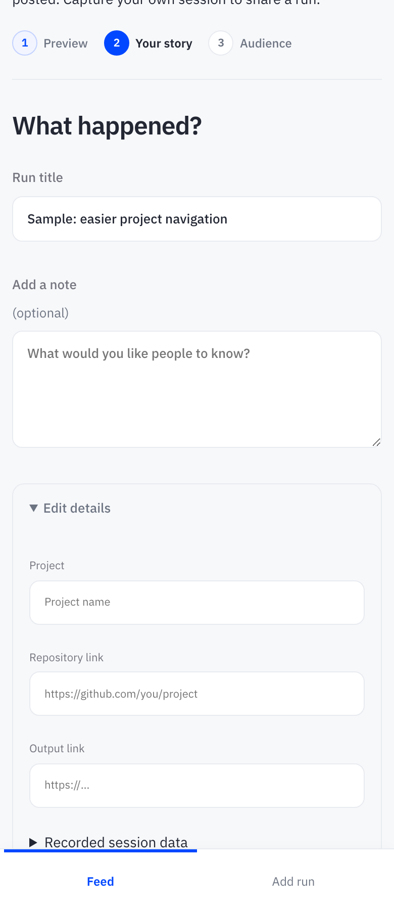
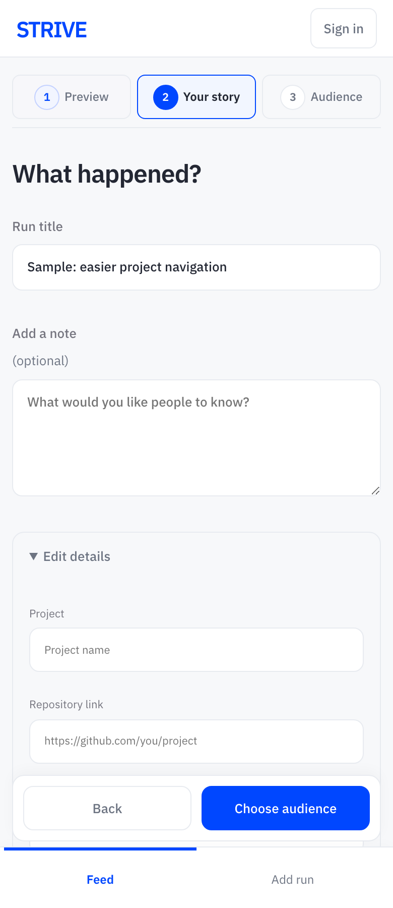

# Three honest stats, framed media, a next step in reach

Cards now show three recorded stats or an honest missing-data panel, with bordered media that preserves the saved personal photo.
Brief count-up, trail draw, hover and XUDOS effects respect reduced motion, while import steps and Choose audience stay in view.
The command wording explains its cross-project search, and verified 390px/1440px captures show no page-wide horizontal clipping.

## Cards

| 390px before | 390px after |
| --- | --- |
|  |  |

[Desktop before](before-card-1440.png) · [Desktop after](after-card-1440.png)

Card screenshots use an already-public FAVOUR run and hide fixed navigation during isolated card capture to avoid a stitched mid-card bar. Actual viewport screenshots separately verify navigation.

## Import

| 390px before | 390px after |
| --- | --- |
|  |  |

[Desktop before](before-story-1440.png) · [Desktop after](after-story-1440.png) · [Missing measurements](after-missing-usage-390.png)

Import images use labelled, unsavable sample data. No private five-run candidates are included. Before is the deployed release; after is local.

## Verification

- Sunday suite, day-card and card-system tests pass: valid estimate priority, fallback order, recorded zero, partial-data template and existing privacy/photo/estimate gates.
- Real browser at 390 and 1440: innerWidth and visual viewport match requested width, document has no horizontal overflow; home, feed, profile and Add a run fit. Earlier Chrome CLI captures had no viewport readback, so no broad CSS fix was inferred from them.
- Expanded form: Choose audience was below the 900px viewport at y1049 (phone) / y1059 (desktop), now remains visible above navigation. Sticky steps and keyboard/mouse navigation retain title, note and Only me. No save or write requests.
- Normal/reduced-motion browser checks: exact final values, one-shot arrival, reduced motion leaves trail/numbers static and disables hover/pop. XUDOS pop was checked with a DOM-only class, never by sending a reaction.
- Production data, five private candidates and estimate upload configuration are unchanged. Awaiting review; not merged.
